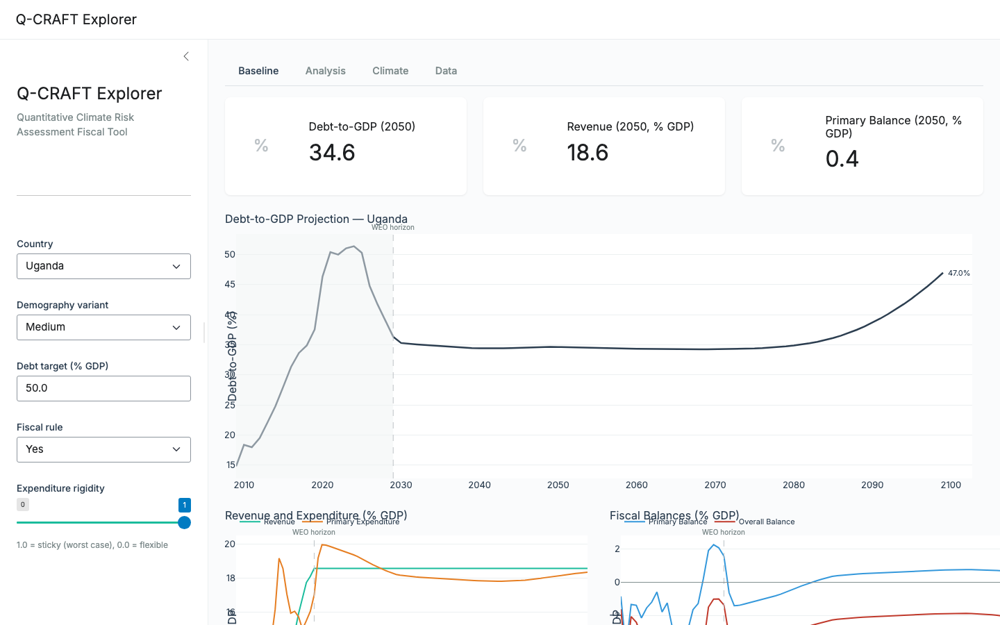

# Q-CRAFT Explorer

**A free, open-source reimplementation of the IMF's Quantitative Climate Risk Assessment Fiscal Tool (Q-CRAFT)**

Q-CRAFT Explorer projects long-term fiscal outcomes (2009-2099) under different climate scenarios for 175 countries. It combines IMF World Economic Outlook data, UN population projections, and the IMF's FADCP climate damage estimates to show how warming affects sovereign debt sustainability.

This is not an official IMF product. It is an independent project by [Teal Insights](https://tealinsights.com) and [NatureFinance](https://naturefinance.net) that aims for full parity with the original Excel-based tool. This is an initial version. We welcome feedback and contributions.



**[Live App](https://tealinsights.shinyapps.io/q-craft_explorer1/)** | **[Companion Guide](https://teal-insights.github.io/QCraft-App/)** | **[Companion Guide (PDF)](https://teal-insights.github.io/QCraft-App/Q-CRAFT-Explorer-Companion-Guide.pdf)**

## Key features

- **175 countries** with WEO macroeconomic data and UN population projections
- **6 climate scenarios** built on IPCC SSP pathways, from Paris-Aligned (1.5C) through Hot Unadapted, with GDP effects from the FADCP Climate Dataset (Centorrino, Massetti and Tagklis, 2024), building on Kahn et al. (2021)
- **Interactive charts** for debt-to-GDP, revenue, expenditure, fiscal balances, and GDP trajectories
- **Adjustable parameters**: demography variant, debt target, fiscal rule, expenditure rigidity
- **Data export** for baseline and all-scenario results (CSV)
- **Two data modes**: Verified runs the October 2024 WEO vintage the published workbook ships; Current runs the April 2026 vintage
- **Verified**: 147 of 147 tested countries achieve perfect baseline parity with the original Excel tool

## Quick start

```bash
uv sync
uv run shiny run apps/qcraft-app/app.py
```

Open http://localhost:8000 in your browser.

### Running it without a network

The Explorer is a static bundle, but it is not a folder you can double-click.
Opening `dist/index.html` from the file system gives a blank page: browsers block
`type="module"` scripts and cross-origin stylesheets under the `file:` scheme, so
nothing loads. Serve the folder instead, which needs no install beyond Python:

```bash
python3 -m http.server 8080 --directory apps/qcraft-web/dist
```

Then open http://localhost:8080. That is the offline route for a training room
with no connection: one command, no network, everything else identical.

## Two data modes

The Explorer runs the same engine over two data vintages, and the mode you pick
decides which.

**Verified** runs the October 2024 WEO vintage, which is the one the published
Q-CRAFT workbook ships. It is the mode the parity claim is about. Baseline parity
verified for 147 of 147 tested countries; climate-scenario parity confirmed for
ratio metrics only.

**Current** runs the April 2026 vintage. Same engine, newer inputs: results will
not match the published workbook cell for cell, because the workbook ships the
October 2024 data vintage.

166 of 175 countries project in Verified mode and 167 of 175 in Current. The rest
refuse with a notice naming the missing series, which is the faithful answer where
the workbook itself yields an error. `docs/country-coverage.md` has the full sweep
table, and `docs/data-vintages.md` records why the shipped climate dataset and the
2030 impact-start convention both stay.

## Architecture

The project is a monorepo with three main components:

- **`packages/qcraft-engine/`**: seven pure-function engine modules (demography, productivity, inflation, baseline GDP, interest rates, fiscal, climate) that compose into a single `run_pipeline()` call. All functions take and return Polars DataFrames. Fiscal recursion uses explicit year-by-year iteration to ensure correct state dependence.

- **`apps/qcraft-app/`**: Shiny for Python UI with Plotly charts. Five tabs: Baseline (summary cards + debt/revenue/balance charts), Analysis (climate scenario comparison), Climate (GDP impact trajectories), Data (table + CSV export), and Methodology.

- **`apps/qcraft-web/`**: the TypeScript Explorer that the training runs on, with a second implementation of the engine held against the Python one by a differential harness. It carries the mode switch, the parameter panels and the export packet.

Data is extracted from the IMF Q-CRAFT Excel workbook and stored as Parquet files in `data/processed/`.

## Verification

147 of 147 tested countries achieve perfect baseline parity (0.0 percentage point deviation) with the original IMF Excel tool. An additional 25 parameter sensitivity combinations were tested, all passing. Climate scenario parity is confirmed for ratio metrics (debt-to-GDP, revenue, expenditure as percent of GDP) across all tested countries and scenarios.

```bash
uv run pytest tests/        # 198 golden-master tests
uv run pyright packages/qcraft-engine/
uv run ruff check .
```

Full verification results are in `verification-logs/`.

## Documentation

- **[Companion Guide](https://teal-insights.github.io/QCraft-App/)**: what Q-CRAFT computes, how to use the Explorer, how to get involved
- **[Companion Guide (PDF)](https://teal-insights.github.io/QCraft-App/Q-CRAFT-Explorer-Companion-Guide.pdf)**: for offline reading and sharing

## Typography and reproducibility

The companion guide is open source under the MIT license, and it builds completely from what is in this repository. The three faces it sets in, Inter, IBM Plex Serif and IBM Plex Mono, are bundled under `docs/companion-guide/fonts/open/` with their SIL Open Font License texts and self-hosted rather than pulled from a CDN. Clone the repo, run `quarto render docs/companion-guide`, and you get the book we publish, on a machine with no network access and inside a ministry network that blocks outside font hosts.

Teal Insights also publishes a house edition set in licensed Klim Type Foundry faces, Söhne and Tiempos Headline, where the license permits. That is a second skin over identical content:

```bash
quarto render docs/companion-guide                  # bundled open faces, the default
quarto render docs/companion-guide --profile brand  # house faces, licensed hosts only
```

The `brand` profile adds one stylesheet, `_brand-fonts.css`, which points at `/fonts/klim/`. Those font files are not in this repository and never will be: the web license covers tealinsights.com, and GitHub Pages is not a licensed host. Render the brand profile anywhere the files are absent and every Klim declaration fails to load, each font stack falls through to the bundled open face, and the book still sets. No word, number or figure in the course depends on which skin you render.

## License

MIT

## Credits

Built by [Teal Insights](https://tealinsights.com) and [NatureFinance](https://naturefinance.net). Based on the IMF Q-CRAFT methodology (Batini et al., 2024).

We welcome feedback: [lte@tealinsights.com](mailto:lte@tealinsights.com?subject=Q-CRAFT%20Explorer%20Feedback)
