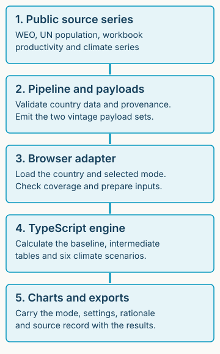

**The current Explorer runs the TypeScript engine in the browser.** Python supplies a reference implementation and data preparation tools. The static site serves assets and country payloads. It does not send the analyst's settings to a calculation server.

## The browser runs the TypeScript engine

| Component | Responsibility | Source |
| --- | --- | --- |
| Data pipeline | Fetch WEO/WPP, retain workbook productivity/climate data, validate and emit vintages. | [pipeline](https://github.com/Teal-Insights/QCraft-App/blob/a6313ad7f8f38e174bd38c89e3419ee1be79cda9/pipeline/README.md) |
| Country data loader | Fetch selected vintage and country, read coverage and adapt the payload shape. | [countryData.ts](https://github.com/Teal-Insights/QCraft-App/blob/a6313ad7f8f38e174bd38c89e3419ee1be79cda9/apps/qcraft-web/src/engine/countryData.ts) |
| Explorer adapter | `prepare(mode, iso3c)` loads data and coverage. `run(context, params)` invokes the engine and turns errors into notices. | [qcraftAdapter.ts](https://github.com/Teal-Insights/QCraft-App/blob/a6313ad7f8f38e174bd38c89e3419ee1be79cda9/apps/qcraft-web/src/engine/qcraftAdapter.ts) |
| TypeScript pipeline | Validate the selected horizon policy, shape inputs and call demography, productivity, inflation, baseline GDP, interest, fiscal and six climate calculations. | [pipeline.ts](https://github.com/Teal-Insights/QCraft-App/blob/a6313ad7f8f38e174bd38c89e3419ee1be79cda9/packages/qcraft-engine-ts/src/pipeline.ts) |
| UI and exports | Render results and assemble provenance, assumptions, rationale and run files. | [manifest.ts](https://github.com/Teal-Insights/QCraft-App/blob/a6313ad7f8f38e174bd38c89e3419ee1be79cda9/apps/qcraft-web/src/run/manifest.ts) |

**Preparation loads data. Calculation runs the method.** `prepare` is an Explorer adapter operation and is not a public engine function. The engine's `runPipeline(input, params)` takes a `CountryInput`, merges overrides over defaults and returns intermediate tables, fiscal results and the six scenario tables. Current inputs carry `HorizonPolicy`; the pipeline recomputes the usable horizon and checks the recorded timing before running. Results carry the policy so screen and export dates derive from the selected run. The mode changes both data revision and calculation policy, while Verified retains the legacy path.

**Fiscal and climate recursion uses prior-year state.** Each year reads the previous year's debt and other inputs. Expenditure growth multiplies its factors. The baseline applies a zero floor to debt, while the climate scenarios preserve the workbook's unfloored calculation. [Fiscal source](https://github.com/Teal-Insights/QCraft-App/blob/a6313ad7f8f38e174bd38c89e3419ee1be79cda9/packages/qcraft-engine-ts/src/fiscal.ts), [climate source](https://github.com/Teal-Insights/QCraft-App/blob/a6313ad7f8f38e174bd38c89e3419ee1be79cda9/packages/qcraft-engine-ts/src/climate.ts).

## Documentation and engine source have separate identities

**A documentation update does not change an immutable engine revision.** This package builds from a docs-only branch based on main. API extraction reads a second checkout at the engine commit recorded in `source-manifest.json`. The country payload archive has its own checksum and carries Verified, earlier Current and full-horizon Current payloads. A reproducible release names the docs commit, tool commit and exact archive. New saved runs also carry the country input hash and policy identity.

**The public site is assembled as one complete artifact.** The current six-page [operating companion](https://teal-insights.github.io/QCraft-App/guide/) owns `/QCraft-App/guide/`, the Explorer owns `/QCraft-App/explorer/`, and these docs own `/QCraft-App/docs/`. The older March guide remains at the root with a historical banner. The longer training course is being revised separately. Release assembly preserves these namespaces and older URLs; this package changes no publication workflow.

## The earlier Shiny application is a separate interface

**`apps/qcraft-app/` is the historical Shiny for Python application.** It loads local Parquet tables and calls the Python engine. Its startup command does not launch the browser Explorer. Use the [current Explorer setup](reproduce.md) for the interface these pages describe.

