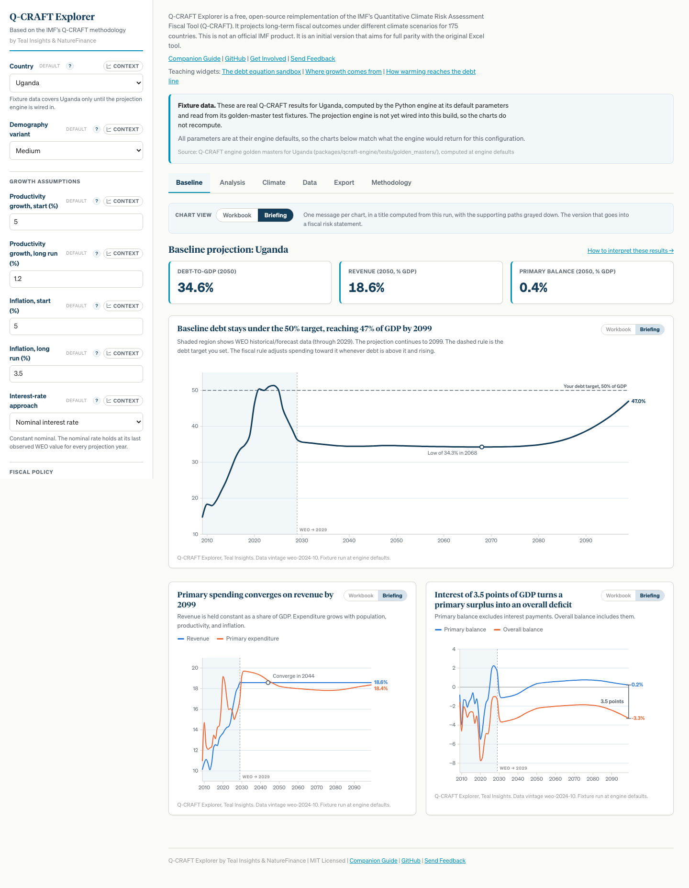
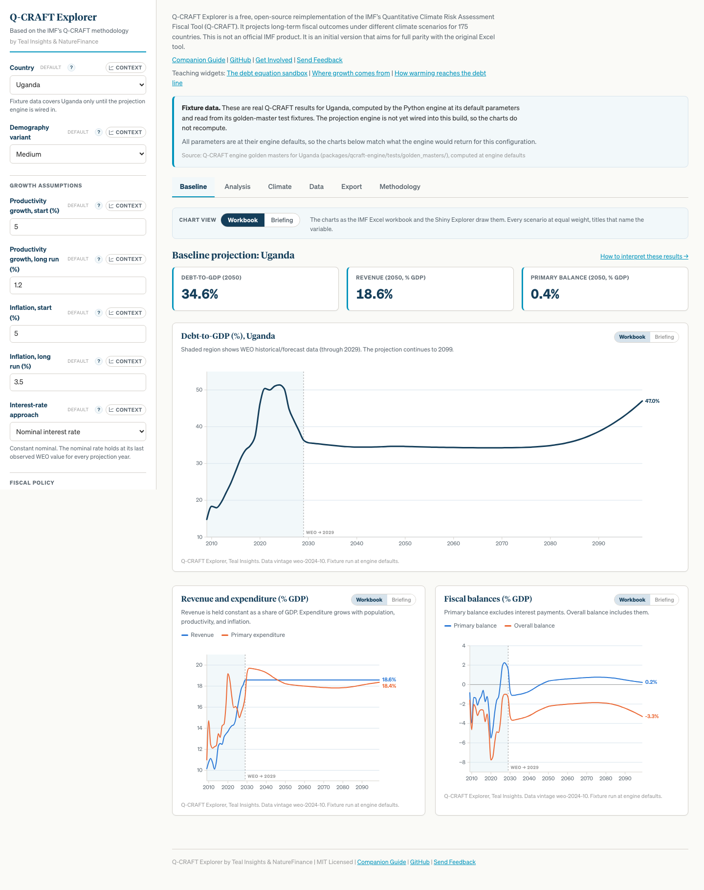
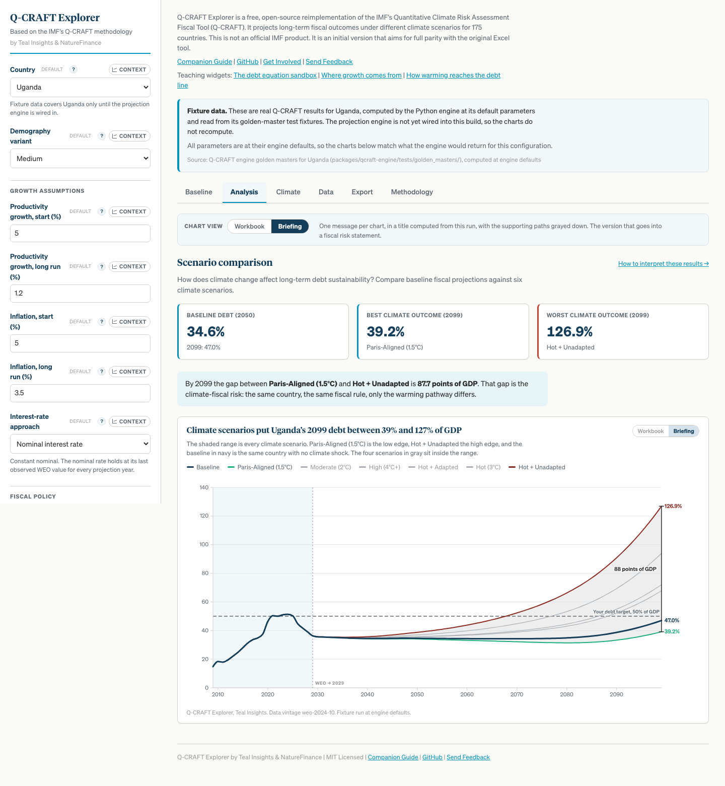
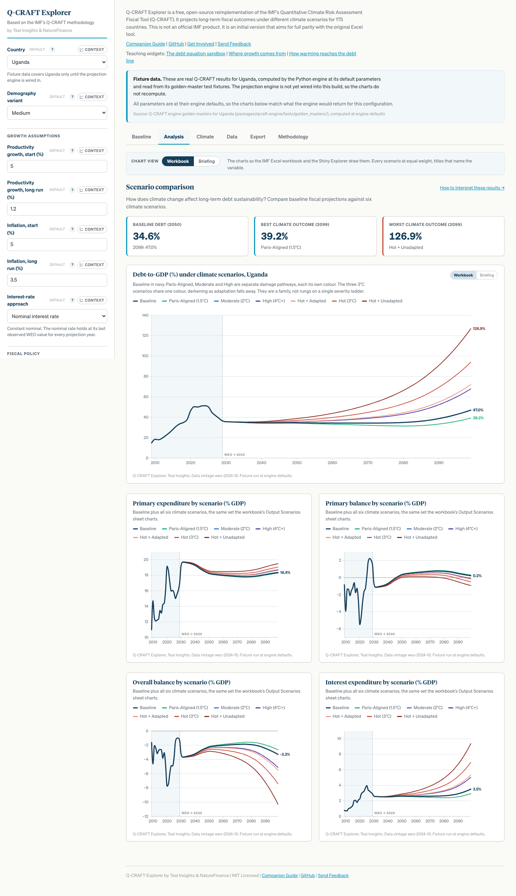
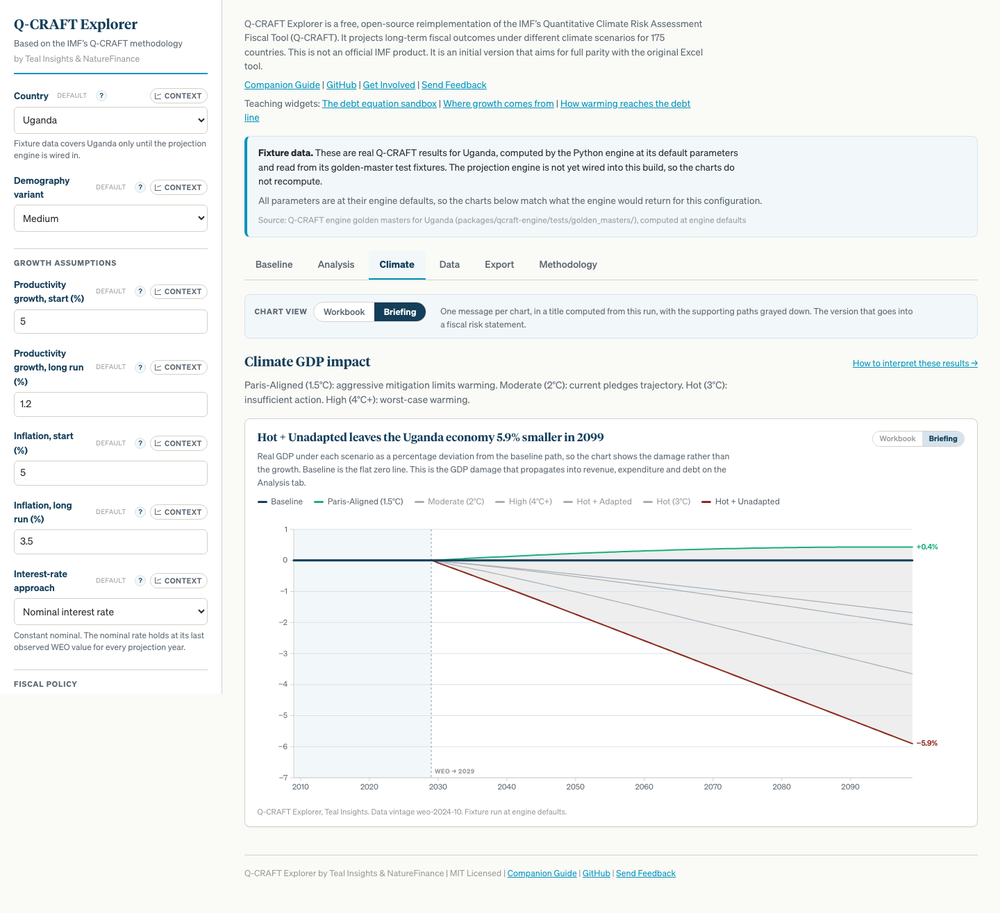
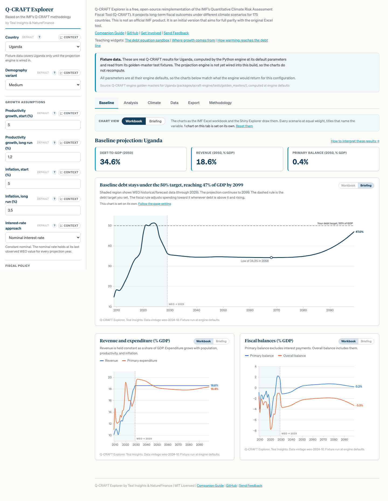
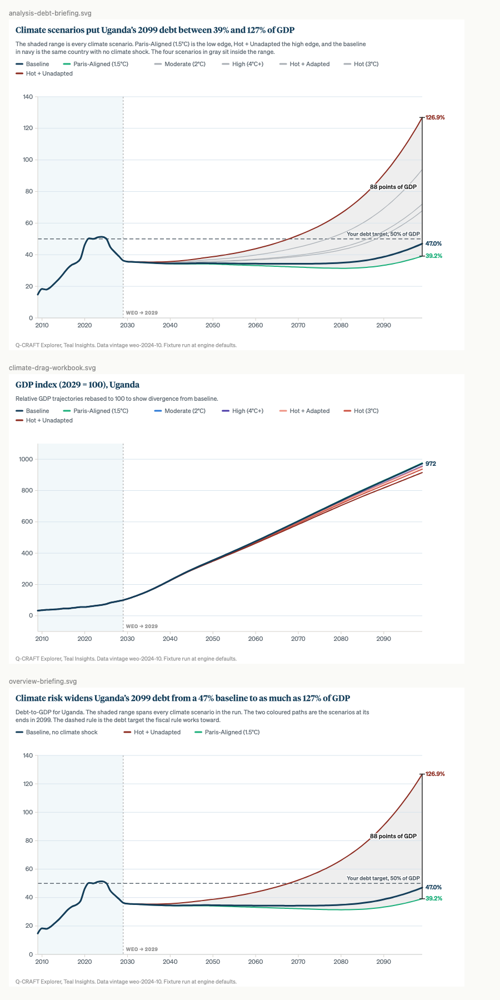

# CC-4: the two chart registers

**Branch `feat/takeaway-charts`, off `feat/explorer-v2-integration`. Draft PR
[#61](https://github.com/Teal-Insights/QCraft-App/pull/61). Issue TEA-1400.
2026-08-27.**

---

## 1. Bottom line

Every chart in the Explorer now exists in two versions of itself, and both feed
the exports through one seam.

**Workbook** is what the IMF Excel workbook and the Shiny Explorer draw. Titles
name the variable, every scenario is drawn at equal weight, nothing is
annotated. Recognition is the whole job, so the app does not improve it.

**Briefing** carries one message, stated in a title computed from the run, with
everything that is not the message grayed down and the claim measured on the
chart rather than asserted in the caption.

The register is global with a per-chart override, remembered between sessions.
Five continuity charts the app had dropped are restored on the way.

Gates: 155 tests pass, 21 of them new. Typecheck and lint clean. Both registers
screenshotted on every chart tab, plus the per-chart override, plus every export
SVG rendered and inspected at true size.

One item is held for Teal, in section 8: the computed title templates. They are
the app's most quotable strings and they will land in published fiscal risk
statements. Everything is built and working behind that gate.

---

## 2. The money chart per tab

| Tab | Message | How the chart states it |
| --- | --- | --- |
| Baseline | Where the debt path ends up against the debt target | Dashed target rule, callout on the crossing year, or on the projection low when there is no crossing |
| Analysis | The range the warming pathway opens up | Shaded envelope across all six scenarios, bounding scenarios in colour, the horizon spread bracketed and measured |
| Climate | The growth drag | Deviation from baseline rather than levels, envelope, direct labels on the two ends |
| Cover | The whole run in one picture | Baseline, the envelope, the target rule, the spread bracket |

### Baseline, briefing register



The title reads `Baseline debt stays under the 50% target, reaching 47% of GDP
by 2099`. It is not a sentence with numbers typed into it: the Uganda baseline
never crosses its target, so the crossing branch does not fire and the title
says what is true instead. A path that did cross would read `Baseline debt
passes the 50% target in 2061`, with the year coming out of the projection.

The callout marks the projection low, `Low of 34.3% in 2068`, which is the shape
of the path the title cannot carry. It is the projection's low, not the whole
record's: Uganda's debt already peaked at 51.4% in 2024, and reporting an
observed peak as a finding of the projection would be wrong.

The two half-width charts show the other two title shapes. `Primary spending
converges on revenue by 2099` gets a callout on the year they converge;
`Interest of 3.5 points of GDP turns a primary surplus into an overall deficit`
gets a bracket measuring the interest wedge, because the wedge between the two
balances IS the interest bill.

### Baseline, workbook register



`Debt-to-GDP (%), Uganda`. `Revenue and expenditure (% GDP)`. `Fiscal balances
(% GDP)`. The Shiny Explorer's own wording, minus the em-dash. No target rule,
no callouts, no brackets, no muting. A participant with the workbook open sees
the same picture.

### Analysis, briefing register



`Climate scenarios put Uganda's 2099 debt between 39% and 127% of GDP`. The
shaded range is every climate scenario; Paris-Aligned and Hot + Unadapted carry
colour and direct labels because they are the ends of the range the title
states; the four in between are grayed down. The bracket at the horizon measures
`88 points of GDP`.

Every path stays on the chart. Dropping the middle scenarios would change what
the chart claims, so the register removes their emphasis and nothing else. They
keep their legend entries, in the muted stroke, and the hover tooltip still
lists all seven in their own colours.

### Analysis, workbook register



The seven paths at equal weight, plus the four Output Scenarios charts restored
(section 4).

### Climate, briefing register



`Hot + Unadapted leaves the Uganda economy 5.9% smaller in 2099`.

This is the one chart where the two registers plot different quantities. The
workbook register shows real GDP in levels and indexed to 2029, which is what
the Shiny Explorer shows. The briefing register shows the deviation from
baseline, because the index cannot carry the message: Uganda's real GDP grows
roughly tenfold over the horizon, so a 6% climate shortfall is about a line
width and all seven paths sit on top of each other. Both subtitles state exactly
what is plotted, so neither register can be mistaken for the other.

### The per-chart override



The page is on Workbook and the debt chart is on Briefing. The page control says
`1 chart on this tab is set on its own. Reset them`, and the chart says `This
chart is set on its own. Follow the page setting`. Flipping the global clears
the overrides, because a global control that leaves some charts behind is a
control people stop trusting.

---

## 3. The fiscal ceiling question, and how it was answered

The brief asked for "the path against any fiscal ceiling". Before drawing one I
searched the engine, the params, the Shiny app, the Python engine and the TS
engine for `threshold`, `ceiling`, `anchor`, `benchmark`, `limit`, `target`,
`rule`, `55`, `50`, `dsa`, `dsf`.

**Q-CRAFT has no debt ceiling, no threshold constant and no DSA benchmark.** The
only object in the model that behaves like one is `debt_target`, the user's own
parameter, default 50% of GDP, settable 0 to 200. It enters the model in exactly
two places (`packages/qcraft-engine-ts/src/fiscal.ts`, lines 133 to 141 and 203
to 210), both as the boolean `debt_to_gdp > debt_target`, gating whether the
fiscal gap is applied to next year's expenditure. It never clamps or bounds the
path. The IMF User Guide, quoted in `planning/oracles/fiscal.md`, is explicit
that "the debt ceiling target is never precisely achieved".

So the chart draws `debt_target`, and three rules follow from what it is:

1. **It is labelled "Your debt target"**, never a sustainable level and never an
   IMF threshold. `docs/companion-guide/part2-using.qmd` tells the user to bring
   their own number and `context/panels.ts` says the same: it is a policy
   anchor, usually out of a fiscal responsibility charter. Promoting that
   guidance prose to a rendered line would have been a fabricated standard on a
   ministry-facing tool.

2. **With the fiscal rule off, no line is drawn at all.** The number is inert
   when `fiscal_rule` is `No`, and a dashed rule across a chart it is not acting
   on invites the reader to take it for an external standard. The title falls
   back to a different shape (`With the fiscal rule off, baseline debt climbs to
   47% of GDP by 2099`) and the subtitle says why the line is absent.

3. **It is drawn at the value the run actually used**, not the sidebar's value
   when the two differ. The fixture-backed adapter serves one parameter set and
   reports what it could not honour; a rule drawn at a requested-but-unused
   target would be a false claim on the chart. In that case the label reads
   `Debt target as run, 50% of GDP`. A test pins this.

---

## 4. Continuity: five charts restored

The workbook has 39 charts and the app reproduced 11 of them. Most of the gap is
structural, not chart work (section 7). Five were reachable with no engine
change and are now back:

| Chart | Workbook or Shiny origin |
| --- | --- |
| `climate-gdp-levels` | Shiny `chart_climate_gdp`, `Real GDP (LCU, Billions)`. The one Shiny chart the React app had dropped. `gdpSeries()` and `fmtGdp()` were already written and tested, called by nothing. |
| `analysis-prim-exp` | Workbook `Output Scenarios` chart 34 |
| `analysis-prim-balance` | Workbook `Output Scenarios` chart 35 |
| `analysis-overall-balance` | Workbook `Output Scenarios` chart 36 |
| `analysis-interest-exp` | Workbook `Output Scenarios` chart 37 |

The workbook charts six metrics by scenario; the app charted one. Four of the
missing five are reachable from `FiscalYear` as it stands. The fifth, interest
expenditure as a share of revenue, needs revenue in LCU levels, which
`toFiscalYear` drops. It is recorded rather than faked from the ratios that are
available.

All five are workbook-register only. They carry no single message, which is
exactly why they belong in the continuity register and would dilute the other
one. A workbook-only chart is **absent** under Briefing rather than falling back
and quietly making the briefing view longer.

---

## 5. One structural change, and what it bought

`components/LineChart.tsx` and `export/chartSvg.ts` were two independent
implementations of the same picture. `chartSvg.ts` said its geometry
"deliberately mirrors LineChart.tsx", and the mirror had already cracked:

- The WEO boundary label read `WEO → 2029` on screen and `WEO to 2029` in the
  export.
- The `annotation` prop had no export equivalent, so the Baseline tab's callout
  never reached the report.
- The two disagreed on how an empty series set is handled.

That is affordable for a line and an axis. The briefing register adds an
envelope, a threshold rule with adaptive label placement, a measured bracket,
grayed-down series, callouts and label halos. Building each twice is how the
printed chart stops being the chart the reader was looking at.

So the drawing was factored out:

- `src/charts/plan.ts`: `buildChartPlan(spec, size)` compiles a `ChartSpec` to
  drawing primitives. Pure, no DOM, no React. All layout arithmetic lives here.
- `src/charts/svg.ts`: `renderSpecSvg(spec, options)` serialises the same
  primitives. Pure. A switch over `ChartPrim` and nothing else.
- `LineChart.tsx` paints the same primitives and adds the crosshair and tooltip
  on top.

`export/chartSvg.ts` keeps its exact signature as a shim, so CC-3's callers and
tests are unaffected. `docs/CC4-CHART-SEAM.md` records every crossing into
another lane's territory.

### The export figures



`renderSpecSvg(spec, { withChrome: true })` draws the takeaway title, the
subtitle, the wrapped legend and the source line into the SVG itself, so a PNG
of a briefing chart still says something. A cropped title is a chart with no
message left.

Two craft details visible here:

**Label halos.** Threshold labels, bracket measurements and callouts sit on the
data they are about, which means they sit on lines. Each carries a
surface-coloured outline painted under the glyphs. A filled box would have hidden
the line the callout points at.

**The export legend keeps the muted series.** On screen a grayed-down line's
identity is recoverable from the hover tooltip. Paper has no hover, and four
unidentifiable gray lines on a page is not a chart, so the muted entries stay in
the exported legend, in their muted stroke, and the legend wraps across rows.

---

## 6. Decisions made, with reasons

Recorded here because the operating contract says to decide and record rather
than ask.

1. **The fiscal ceiling is `debt_target`.** Section 3. The alternative options
   were a crossing year with no line, no anchor at all, or surfacing
   `debt_stabilizing_primary_balance`. The last needs an adapter widening and is
   CC-3-adjacent, so it is a roadmap item, not this pass.

2. **Workbook is the default register.** A training arc that starts by reframing
   every chart before the participant has recognised any of them undercuts the
   continuity promise. One constant in `charts/register.ts` reverses it.

3. **The boundary label unified on the arrow.** The two renderers now emit one
   string from one place. The arrow is what the screen has always shown, so the
   export moved to match the screen. One assertion in `tests/export.test.ts`
   changed, with a comment saying why.

4. **The cover chart draws real scenario paths, not envelope edges.** The
   envelope is a per-year maximum across every scenario, so its upper edge is
   whichever scenario is highest that year. Labelling that edge `Hot +
   Unadapted` would name a scenario for a path that is not it. The band stays
   the honest envelope, unlabelled by scenario; the two coloured lines are the
   real scenario paths. Caught in the visual QA loop and pinned by a test.

5. **The threshold label picks its end by region, not by endpoint.** Comparing
   only the first and last value sent the Uganda label left, onto the 51.4% peak
   the path makes in 2024. It now compares the closest approach anywhere in the
   leftmost and rightmost third.

6. **The wordmark on a travelling figure is a text credit**, `Teal Insights`, in
   the source line, rather than the brand mark asset. The mark is a PNG in
   `lte-workbench/brand`; shipping an unverified copy into this repo was the
   wrong call to make unilaterally. If you want the real mark on exported
   figures, it is a small change to `renderSpecSvg`.

7. **Titles round to whole points; chart labels carry one decimal.** A title is
   read at a glance and `between 39% and 127% of GDP` is the claim. The decimal
   belongs where the reader is measuring.

8. **In-figure type stays at 11px rendered.** `brand/figure-typography.md` sets
   a 16px canvas floor for a 1600px canvas rendering at 0.69 scale, which is
   about 11px on screen. These charts render at 1:1, so 11px matches the
   reference implementation's effective size rather than undercutting it.

---

## 7. What is not done, and why

1. **The export packet does not render the new charts yet.** `reportHtml.ts` is
   CC-3's file. The seam is built and tested: `exportFigures(ctx, register,
   overrides)` returns every figure for a register with the per-chart overrides
   applied, and `renderSpecSvg` turns any of them into a standalone SVG. **CC-3
   has to make one change**: `reportHtml.ts` partitions figures by id prefix
   (`baseline-` / `scenario-`) and silently drops the rest, which under the
   current ids would keep three of twelve charts. `exportFigures` returns a
   `tab` on every figure; partition on that.

2. **Twenty-eight of the workbook's 39 charts are still unreproduced**, and most
   are blocked at the engine seam rather than in chart code:
   - `FiscalYear` carries six fields, so anything needing levels (all three
     `interest expenditure / revenue` charts) is uncomputable.
   - `GdpYear` carries `real_gdp` only, so `wb-ob-growth-decomp`, the stacked
     bars plus line that explains where nominal GDP growth comes from, is
     unbuildable. It is the workbook's only non-line chart and the highest-value
     gap.
   - `ScenarioSeries` exposes `fiscal` and `gdp` only, dropping the demography,
     productivity, inflation and interest-rate blocks the pipeline returns. That
     puts the entire Macrofiscal wall (11 charts) out of reach.
   - The three `Climate Data` charts showing the FADCP damage input are missing
     too, which means the app shows the consequence of the damage and never the
     assumed damage itself. Worth a decision on its own: a briefing chart that
     says "climate costs 88 points of debt" without ever showing the input is a
     claim the reader cannot check.

3. **The run manifest does not yet record the register.** Two runs with
   identical parameters and different registers produce different documents, so
   the register and its overrides belong in the manifest. `run/manifest.ts` is
   CC-3's file; `useChartRegister().describe()` returns exactly the object they
   need.

4. **A cross-lane collision, fixed but worth naming.** The shared working tree at
   `~/GitHub/QCraft-App` had another lane's uncommitted work in it (CC-2, 31
   files) while sitting on `feat/explorer-v2-integration`. Creating a branch
   there carried their changes onto my branch. I moved to an isolated worktree at
   `~/GitHub/QCraft-App-cc4`, put the shared tree back on its branch with their
   changes untouched, and verified 31 modified files were still there. CC-3 and
   CC-5 already work in their own worktrees; the main tree is the one that is
   shared by default, and it is where this will happen again.

---

## 8. Held for Teal

**The computed title templates.** Three lines of context: the briefing register
generates its own prose, so the templates are the app's most quotable strings,
and they are the sentences most likely to be pasted verbatim into a published
fiscal risk statement. They make claims about the model's output, not about the
IMF original, so nothing here touches the parity wording. They are built and
working; this is sign-off, not a blocker.

The full set, as they render for Uganda at engine defaults:

| Chart | Title |
| --- | --- |
| Baseline debt | `Baseline debt stays under the 50% target, reaching 47% of GDP by 2099` |
| (crossing branch) | `Baseline debt passes the 50% target in 2061` |
| (rule off branch) | `With the fiscal rule off, baseline debt climbs to 47% of GDP by 2099` |
| Revenue vs expenditure | `Primary spending converges on revenue by 2099` |
| Balances | `Interest of 3.5 points of GDP turns a primary surplus into an overall deficit` |
| Scenario fan | `Climate scenarios put Uganda's 2099 debt between 39% and 127% of GDP` |
| Growth drag | `Hot + Unadapted leaves the Uganda economy 5.9% smaller in 2099` |
| (no coverage branch) | `The climate dataset carries no growth effect for Maldives` |
| Packet cover | `Climate risk widens Uganda's 2099 debt from a 47% baseline to as much as 127% of GDP` |

Options:

**A. Ship as written.** Recommended. Every one is a single clause, states its
claim plainly, and names only quantities the run produced. They pass a
mechanical lint for em-dashes, the three banned title shapes (tics 10, 11, 12)
and the filler list. The no-coverage branch is deliberately a statement about
the data rather than about risk, consistent with the honest-broker stance and
with the standing notice CC-2 owns.

**B. Soften the cover title.** `Climate risk widens ... to as much as 127% of
GDP` is the strongest sentence in the set. It is true of this run and the chart
measures it, but "as much as" reaches for the tail. A flatter alternative:
`Uganda's 2099 debt is 47% of GDP under baseline and 127% under Hot +
Unadapted`.

**C. Change a specific line.** Name it and I will change the template, not the
instance.

Cost of deferral is low: the templates live in one file
(`src/charts/titles.ts`), each is a pure function, and a change is a one-line
edit plus a test run. Nothing downstream is blocked by leaving this open through
the freeze, as long as it is settled before the packet is used in a real
document.

---

## 9. Rerun commands

From `apps/qcraft-web/` on `feat/takeaway-charts`.

```bash
npm run typecheck && npm run lint && npm test
```

Visual QA. Pin the port: other lanes leave a preview on the default 4173, and a
QA pass that silently screenshots somebody else's build is worse than none.

```bash
npm run build
npm run preview -- --port 4183 &
QCRAFT_PREVIEW_URL=http://localhost:4183/ npm run qa:registers -- /tmp/qcraft-registers
```

Every export SVG, written out for inspection at true size:

```bash
QCRAFT_WRITE_SVG=/tmp/qcraft-svg npx vitest run tests/chartSpecs.test.ts
```
