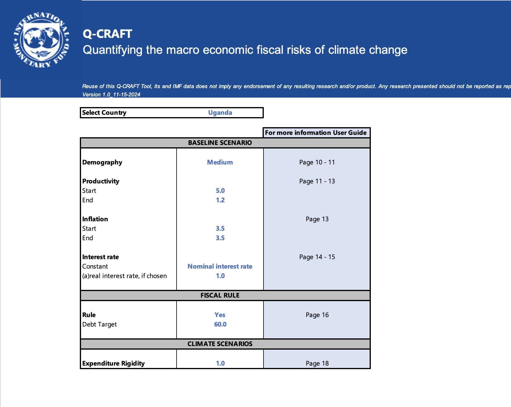
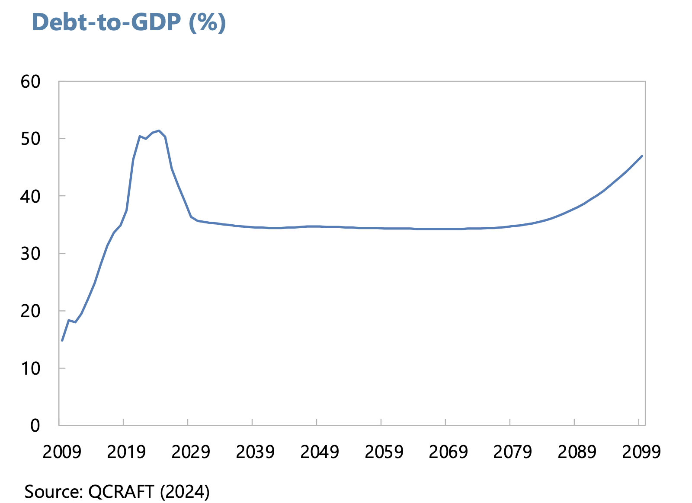
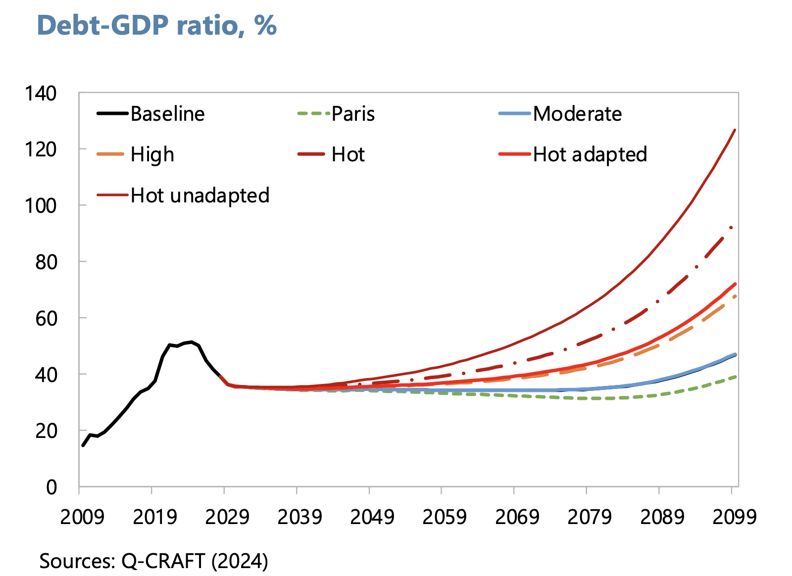

# Running the official workbook {#sec-appendix-workbook}

::: {.callout-note}
## The User Guide is the official manual
The IMF's User Guide [(Tim and Rahman, 2024)](references.qmd#src-user-guide) is the authoritative reference for operating the workbook, and where this appendix and the Guide ever differ, the Guide is right. This appendix is the quick orientation: download the workbook, run a country, find the outputs, and see each control mapped to the concept the course taught.
:::

**Everything the course taught transfers.** The workbook and the Explorer run the same model (@sec-m1-parity is the check), so the concepts, the parameter judgments and the reading of the output carry over unchanged. What differs is operational: where the controls live, and where the results come out.

## Download and open

**The Fund posts the workbook as one file, and it opens without installation.** Download the [Excel workbook](https://www.imf.org/-/media/files/topics/fiscal/fiscal-risks/tool/qcraft-toolv10.xlsx) from the IMF's [Q-CRAFT page](https://www.imf.org/en/Topics/fiscal-policies/Fiscal-Risks/Fiscal-Risks-Toolkit/Fiscal-Risks-Toolkit-Q-Craft), where the [User Guide (PDF)](https://www.imf.org/-/media/files/topics/fiscal/fiscal-risks/tool/qcraft-user-guidev10.pdf) sits beside it. The file is a plain `.xlsx` with no macros, so there is nothing to enable and it opens under standard ministry IT policies. This appendix describes version 1.0, dated 15 November 2024 on its own Dashboard.

**Read the *Read Me* sheet first, and expect `#VALUE!` on first open.** The Read Me sheet carries the colour conventions (a green Dashboard, blue input sheets, red scenario calculations, yellow outputs; green cells are inputs, black cells are calculations) and lists the ten steps of a full run. The workbook ships with Afghanistan selected, a country whose WEO series has gaps, so many output cells read `#VALUE!` when the file first opens. Nothing is broken: select a country with a complete series and every cell fills in.

## The Dashboard runs the whole tool

::: {.qc-shot}

:::

**Select a country in cell C12 and the workbook does the rest.** The macro series, the population projections and the climate estimates all belong to that selection, and every sheet recalculates. That one cell is the Explorer's country dropdown. The *Macrofiscal* sheet then shows the diagnostic charts for the country you picked, the same look-before-you-project habit @sec-m1 teaches with the data banner and the Baseline tab.

**The controls beneath it are the course's controls under their workbook names.** The concepts were built in @sec-m2, and @sec-m3 is where you learned to choose and defend each value:

| On the Dashboard | Ships as | What it sets |
|---|---|---|
| Demography (C17) | Medium | the population variant behind employment growth |
| Productivity, start and end (C20, C21) | 5.0 and 1.2 | the productivity convergence path inside *g* |
| Inflation, start and end (C24, C25) | 3.5 and 3.5 | the deflator path that turns real growth nominal |
| Interest rate (C28, C29) | Nominal interest rate | the *r* applied to the debt stock |
| Rule and Debt Target (C33, C34) | Yes and 60 | the fiscal rule acting on the primary balance |
| Expenditure Rigidity (C38) | 1.0 | how fully spending holds on when growth disappoints |

**The shipped settings are a real run rather than placeholders, and one of them is worth noticing.** The workbook arrives with the fiscal rule on and a debt target of 60 percent of GDP, while the User Guide's worked example starts with the rule off ([p. 18](references.qmd#src-user-guide)). The worked example in @sec-m4 keeps the workbook's shipped setting and documents both readings.

## Where the outputs live

**Two yellow sheets carry the results: *Output Baseline* for the no-climate run, *Output Scenarios* for the comparison.** The Read Me's own sequence has you assess the baseline before opening any scenario, the same order the course works in.

::: {.qc-shot}

:::

**Output Scenarios opens with summary tables and follows with charts.** The debt table reads the ratio at 2023, 2050, 2075 and 2099 for the baseline and all six scenarios, and the debt chart draws the same picture the Explorer's Analysis tab draws. With Uganda selected and every control at its shipped value, the baseline reads 47.0 percent of GDP at 2099, the figure the worked example in @sec-m4 builds on.

::: {.qc-shot layout-ncol="2"}

:::

## The ten steps, and where the course taught each

**The Read Me sheet lists a full run as ten steps, and the course covered every concept in the eight core ones.**

| The workbook's step | Where the concept lives |
|---|---|
| 1. Choose country | the ten-minute run in @sec-m1 |
| 2. Choose demography scenario | @sec-m3 |
| 3. Choose productivity assumptions | @sec-m3 |
| 4. Choose inflation assumption | @sec-m3 |
| 5. Choose interest rate assumptions | @sec-m3 |
| 6. Assess the baseline | @sec-m4 |
| 7. Analyse the macroeconomic effects of climate change | @sec-m2, Step 3 |
| 8. Analyse the climate scenarios | @sec-m4 |
| 9. Add discrete risks (optional) | outside this course; the User Guide covers it |
| 10. Adjust expenditure rigidity (optional) | @sec-m3 |

## Three operational differences from the Explorer

**Knowing these in advance saves the surprise.** The posted workbook ships one data vintage, WEO October 2024 with the 2022 UN population revision, and the data ages until the Fund posts a new file. Saving your assumptions means saving the file: there is no rationale field and no export packet, so the write-it-down discipline from @sec-m3 is yours to keep by hand. And where a country's series is missing, cells read `#VALUE!` where the Explorer would show a plain-language notice.
