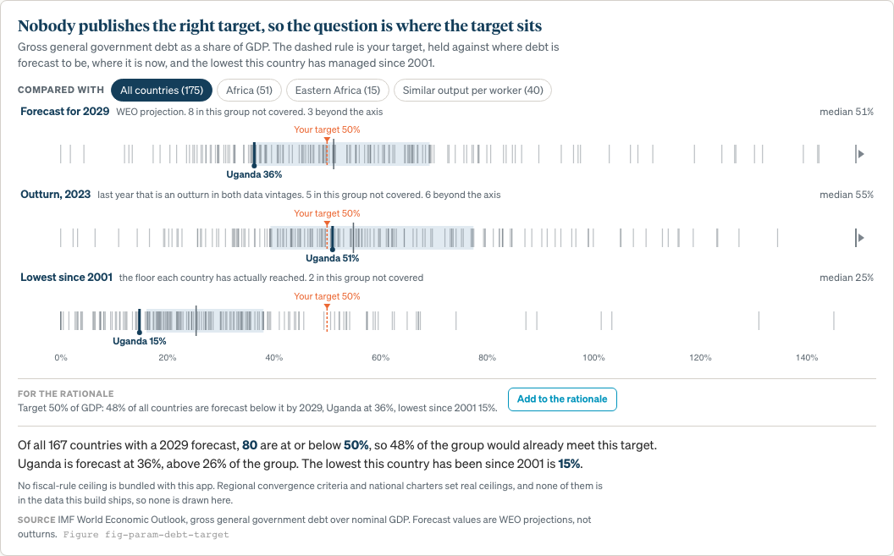
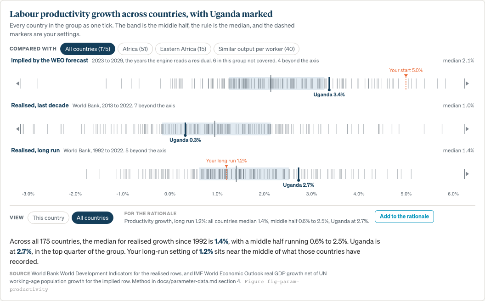
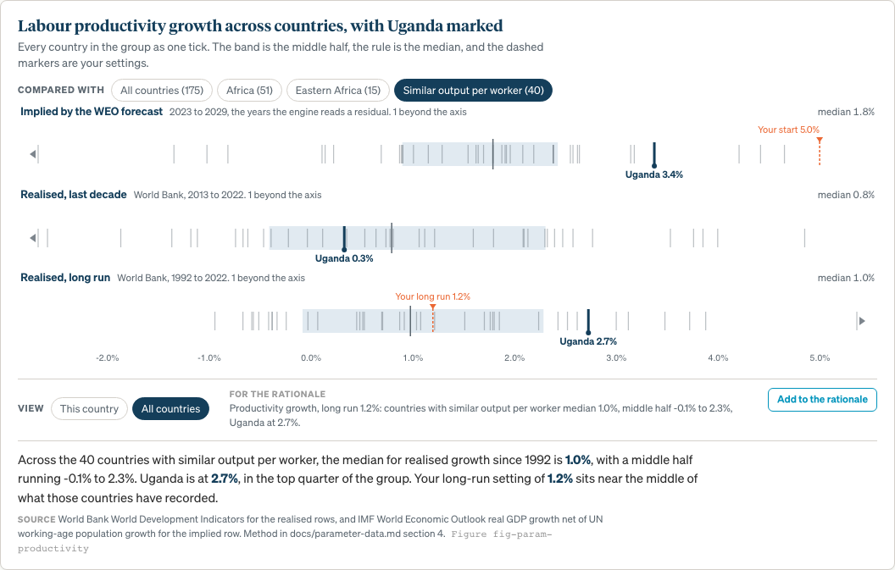
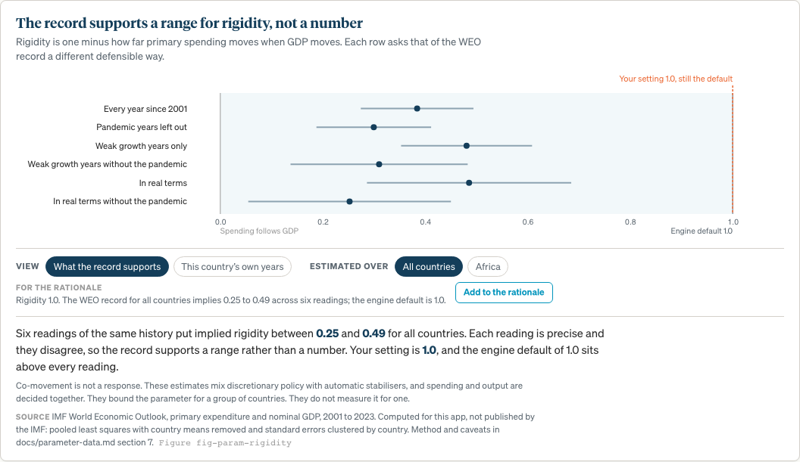
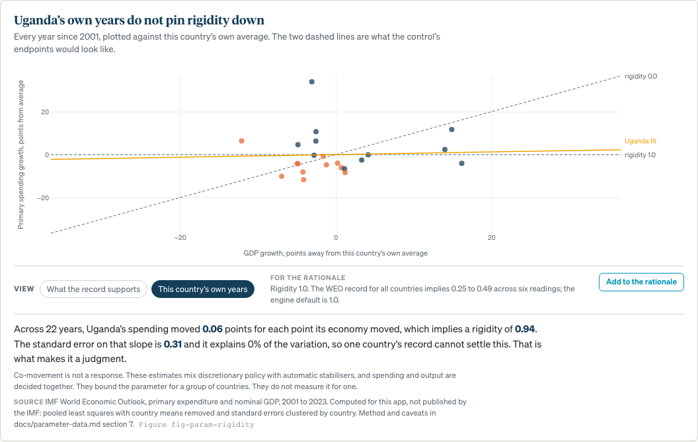

# CC-5: parameter discovery v2, distributions and peers (TEA-1400)

**Branch:** `feat/param-discovery`, cut from `feat/explorer-v2-integration` ·
**Date:** 2026-08-27 · **Draft PR:** [#63](https://github.com/Teal-Insights/QCraft-App/pull/63) ·
**UI freeze:** Sat 2026-08-29 EOD

The context panels from run 4 answer one question: what does the published
source say about my country. This lane adds the second, "where does my country
sit", for all 175 selectable countries, using bundled data only.

One gate is open, on the wording of what the rigidity panel claims. Everything
else is built and verified.

---

## 1. Bottom line

| | |
| --- | --- |
| Research note | `docs/parameter-data.md`, written before anything was drawn |
| Data derivation | `scripts/derive_peer_data.py`, four CSVs, 301 KB in the bundle |
| Parameters with a peer view | demography, productivity, inflation, interest-rate approach, debt target |
| Parameters that gained a panel | debt target, expenditure rigidity |
| Peer axes | world, region, subregion, similar output per worker |
| Gate open | the rigidity panel's wording, `docs/parameter-data.md` §7.5 |
| Tests | 162 pass across 11 files, 28 of them new |

---

## 2. The research leg, and what it settled

`docs/parameter-data.md` is the deliverable that gated the build. Five findings
changed what got built:

**The history boundary was established, not assumed.** Neither vintage flags
which years are outturns. Differencing them year by year showed agreement to four
decimal places through 2018, drift from 2019 as national accounts are revised,
and a jump at 2024. So every historical statistic stops at 2023, which is an
outturn year in both vintages, and the same statistic can be quoted in either
data mode without the story changing under the reader.

**Productivity has three answers in the bundle and they disagree.** The engine
back-calculates productivity as a residual from 2023, so `productivity_start`
first does work in 2030. The residual the engine reads has a world median of
2.1%; the realised World Bank record over the same countries' last decade has a
median of 1.0%. The panel shows all three rows rather than picking one, because
picking one would have meant choosing which disagreement to hide.

**Income groups are not in the bundle.** WPP publishes nine income-group rows
as aggregate locations and no country is parented to one, so membership cannot
be derived. Checked rather than assumed: zero of 237 countries have an
income-group parent. Region and subregion are derivable and cover all 175
selectable countries.

**No fiscal-rule ceiling is bundled.** WEO carries outturns and forecasts, not
law. Asserting another country's statutory ceiling inside a ministry-facing tool
needs a primary document per row, so none is drawn. The panel places the target
against where debt actually is instead.

**Rigidity does not survive as a country-level number.** Section 4 below.

---

## 3. What is in the app

### 3.1 A second view on every data panel

Each panel keeps its record view and gains a peer view behind a toggle. The peer
view is a stack of distribution strips: one tick per country, a band for the
middle half, a rule at the median, this country marked and named, and the
sidebar setting drawn as a dashed rule on the same axis.

Rows that share units share one axis and one set of tick labels, so a stack
reads as one chart rather than three that happen to line up. The dashed setting
rule then threads vertically through the whole stack, which is what makes the
debt panel work: the target held against the forecast, the outturn and the floor
at once.



The axis covers the 2nd to 98th percentile and pins the countries outside it to
the edge with an arrow and a count. Before that, one country at 250% of GDP was
pushing the middle half of the other hundred and seventy into the left fifth of
the strip. This country's own value and the user's setting are never allowed off
the axis, whatever percentile they sit at.



### 3.2 Peer axes

Four, and they are named for what they contain rather than for what would be
convenient:

| Axis | Where it comes from | Uganda's set |
| --- | --- | --- |
| All countries | the vintage's own country index | 175 |
| Region | UN WPP location hierarchy | Africa, 51 |
| Subregion | same, where the group is large enough | Eastern Africa, 15 |
| Similar output per worker | WDI GDP per person employed, PPP, 2022 | 40 |

A subregion with fewer than eight selectable countries is blanked in the
derivation and the panel offers the region instead, because a group of two is not
a peer set. Twelve subregions survive that test.

The similarity band is the 40 countries nearest on log output per worker. A band
rather than terciles, because tercile cut points would be an invented
classification and a distance is just a distance.



### 3.3 Two parameters that had no panel

**Debt target.** Where debt is forecast to be, where it is now, and the lowest
each country has reached since 2001. The third row is the one that turns a number
into a conversation: a 50% anchor reads differently to a country that has not
been below 45 since 2011 than to one that was at 20 a decade ago.

The panel says when the fiscal rule is off, so a target the projection is not
acting on does not read as one that is. That follows CC-4's affirmed finding: the
app never draws a sustainable level, only the user's own target. The panel keeps
the marker rather than dropping it, because the panel is the target's context and
hiding its subject would leave a chart with nothing to place.

**Expenditure rigidity.** Section 4.

### 3.4 The peer choice travels into the export packet

The annotations schema belongs to CC-3, so nothing new is defined here. A run
already carries one free-text rationale per parameter, the report annex prints it
beside the value and its default state, and the run JSON restores it on import.
A peer comparison is a reason for a value, which is what that field is for.

So each panel composes a sentence from what it is showing, displays it before
writing anything, and one button appends it to that parameter's rationale. It
appends rather than replaces, and clips to the field's own 200-character cap at
the point it is written rather than on the user's next keystroke.

`npm run qa:export` now presses that button and follows the sentence into the
report annex, into the run JSON, and back through a reset and re-import. A real
run reads:

> Charter for Fiscal Responsibility ceiling, agreed with MoFPED. Target 45% of
> GDP: 31% of Africa are forecast below it by 2029, Uganda at 36%, lowest since
> 2001 15%.

---

## 4. Expenditure rigidity, and the gate

### 4.1 The target is exact

`climate.py` phase 3 holds primary expenditure at
`PE_base * (1 + (1 - rigidity) * g)` for a proportional GDP shock. So rigidity is
one minus the elasticity of primary expenditure to GDP. The model states the
elasticity it wants, and the WEO history records how spending has actually moved.

### 4.2 Per-country estimates do not survive

Regressing primary expenditure growth on nominal GDP growth country by country,
2001 to 2023, 186 countries with at least ten usable years:

- median R-squared **0.13**
- median standard error on the slope **0.29**, on a parameter defined over a
  range of one
- **73 of 186** countries land outside that range before anything is interpreted
- Uganda's slope is **0.01**, standard error 0.31, R-squared 0.00

Restricting to weak-growth years, which is what the brief suggested, is worse:
eleven observations per country, and Nigeria moves from an implied 0.97 to 0.00.

A distribution strip of those estimates would rank 175 countries on a number none
of them is measured to. That is the one thing this feature must not do.

### 4.3 A peer-group range does survive

Pooled within a group, country means removed, standard errors clustered by
country. World, frozen vintage:

| Reading of the record | Implied rigidity | 95% interval |
| --- | --- | --- |
| Every year since 2001 | 0.40 | 0.29 to 0.51 |
| Pandemic years left out | 0.31 | 0.20 to 0.42 |
| Weak growth years only | 0.49 | 0.35 to 0.63 |
| Weak growth years without the pandemic | 0.32 | 0.15 to 0.48 |
| In real terms | 0.48 | 0.28 to 0.69 |
| In real terms without the pandemic | 0.25 | 0.04 to 0.45 |

Each row is precise. The rows disagree by more than any one of them admits, and
that is the honest width. Africa runs 0.12 to 0.41 across the same six readings.
The engine default of 1.0 sits above every one of them, which the module's own
docstring already says in words: 1.0 is the sticky worst case.



The second view is the country's own years, as the cloud they are, between the
two dashed lines the parameter's endpoints would draw. The caption reports the
standard error rather than hiding it, because for most countries the standard
error is the finding.



### 4.4 The gate

Full options and recommendation in `docs/parameter-data.md` §7.5. In short: A,
ship what the record supports as a range with no country ranking; B, ship a peer
distribution of point estimates; C, ship nothing and keep the existing note.

**Recommendation A**, which is what is built. B invites a trainee to read
Uganda's 0.99 as a measurement of Uganda when it is a standard error of 0.31
around nothing. C costs no correctness, since it is the status quo, and loses the
clearest lesson in the panel set about what a model asks a user to supply.

Deferring costs nothing structural: B is a component swap of about an hour and C
is deleting one registry entry.

---

## 5. Decisions taken without asking

Recorded here because the operating contract says to decide and record.

1. **Both vintages are carried in every reference file**, keyed by a `vintage`
   column, and the panels read whichever the adapter reports. That way CC-2's
   mode switch works without this lane guessing at its interface. Uganda's 2029
   debt ratio differs by 17 points of GDP between the two, so serving one under
   the other's badge would be a real error; a test pins the gap.

2. **Historical statistics stop at 2023 in both vintages**, so the record does
   not change its story when the data mode changes.

3. **No fiscal-rule ceiling table is bundled.** Declining to make a claim needs
   no permission. If the convergence criteria are wanted, that is a separate
   research task with a citation per row and should go through the same claim
   gate as the other IMF-facing copy.

4. **Serbia is left out of the frozen vintage's demography reference set** and
   named on stderr, rather than repaired. See section 6.

5. **The emitted CSVs may not contain a comma, a quote or a newline in any text
   cell**, and the generator now refuses to write one. The browser parses these
   with a deliberate `split(',')` and no quote handling, so a quoted field does
   not fail there: it shifts every column after it by one and renders as a
   plausible wrong number. It happened once in this lane, when three reading
   labels were written with commas and half the rigidity chart silently
   vanished. Guarded in the generator and asserted in the tests.

6. **A worktree at `~/GitHub/QCraft-App-cc5`.** CC-2, CC-3 and CC-5 were all
   checking branches out of the one shared working directory, so each `git
   checkout` was yanking the tree from the other two. The shared directory was
   put back on `feat/export-packet`, where CC-3 had it. The orchestrator has
   since made this the sprint standard.

---

## 6. Handed to other lanes

**Serbia does not run on the frozen verification vintage.** `weo-2024-10`'s
demography table files Kosovo's population under iso3c SRB beside Serbia's, so
SRB carries two values for every variant, age group and year and
`demography_country("SRB")` raises `ComputeError`. SRB is selectable. The April
2026 pipeline routes Kosovo to XKX and the problem does not arise there.

Same class of failure as the Zambia crash, and not on the parity harness's
13-country `PYTHON_ERROR` list. For **CC-6**'s completeness sweep, and for
**CC-2** if Verified mode is going to offer a country that cannot run in it.

---

## 7. Verification

```
cd apps/qcraft-web
npm run typecheck && npm run lint && npm test && npm run build
npm run preview -- --port 4173 &
npm run qa:context          # both views, six panels, 1440x900 fold check
npm run qa:export           # the panel sentence into the packet and back
npm run qa:context-shots -- docs/screenshots
```

```
uv run --with polars --with pyarrow python scripts/derive_peer_data.py --check
```

| Check | Result |
| --- | --- |
| vitest | 162 pass, 11 files, 28 tests new |
| typecheck, lint, build | clean |
| `qa:context` | all six panels open in both views, respond to their parameter, and fit the fold |
| `qa:export` | 20 checks green, including the peer sentence through the annex, the run JSON and a re-import |
| `derive_peer_data.py --check` | committed CSVs match the data |

The context QA gate now fails on four things it did not check before: a peer
caption that does not answer the sidebar, a peer view whose caption or source
line falls below the fold, a rationale sentence that does not reach the input,
and a composed note over the 200-character cap.

---

## 8. Files

| File | What it is |
| --- | --- |
| `docs/parameter-data.md` | the research note, written before the build |
| `scripts/derive_peer_data.py` | the derivation, with `--check` |
| `apps/qcraft-web/src/context/peers.ts` | the reference set as the app reads it |
| `apps/qcraft-web/src/context/data/peers.csv` | 175 countries, region, subregion, output per worker |
| `apps/qcraft-web/src/context/data/peer-stats.csv` | fifteen statistics per country per vintage |
| `apps/qcraft-web/src/context/data/rigidity-points.csv` | the country-year pairs the scatter draws |
| `apps/qcraft-web/src/context/data/rigidity-readings.csv` | the pooled elasticity under six readings |
| `apps/qcraft-web/src/components/context/DistributionStrip.tsx` | one row of a distribution |
| `apps/qcraft-web/src/components/context/PeerStrips.tsx` | the stack and the scope picker |
| `apps/qcraft-web/src/components/context/RigidityCharts.tsx` | the readings chart and the country scatter |
| `apps/qcraft-web/src/components/context/RigidityPanel.tsx` | the panel behind the gate |
| `apps/qcraft-web/src/components/context/DebtTargetPanel.tsx` | the target against the record |
| `apps/qcraft-web/src/components/context/RationaleAction.tsx` | the sentence, and the button that writes it |
| `apps/qcraft-web/tests/context.peers.test.ts` | 28 tests, including the CSV parse contract |
| `apps/qcraft-web/scripts/context-shots.mjs` | figures at their slugs, for this report and for course M3 |
